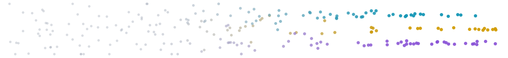
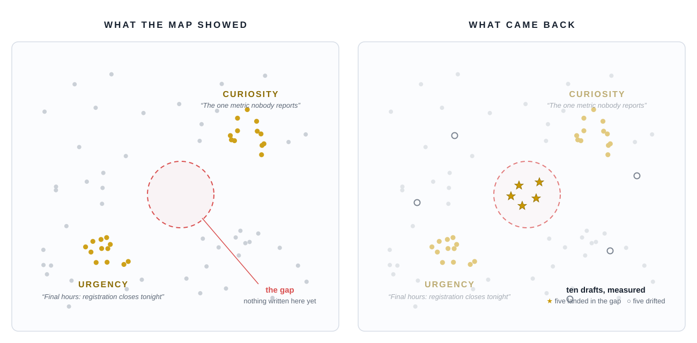

# The Shape of What You've Written

*You have more documents than you can read. Here is how to see all of them at once — and how to write into the spaces between them.*

**J. E. Thomas** · the tool is live in your browser: [document-intelligence.pages.dev](https://document-intelligence.pages.dev)

---

## The pile

Somewhere in your files there is a folder you avoid opening. A year of emails. Every product description. Every review, every abstract, every chapter. Each one was, briefly, the most important thing on somebody's screen.

Now they form a pile, and the pile keeps a secret. Not in any single document — between them: which ones say the same thing in different words, what your best work has in common, what nobody has written yet. Search can't reach it. Search is a flashlight; it finds what you already know to name.

## A strange fact about meaning

Language models learned to do something that still feels like a card trick: they can turn a piece of writing into a **location** — a thousand and twenty-four coordinates you never have to picture, with one property that matters:

> **Texts that mean similar things land close together.**

"Fiscal Q3 performance" sits beside "quarterly revenue results" with barely a word in common. Meaning, it turns out, has geography. So: what does *your* map look like?

## The map

Document Intelligence answers in a browser tab. Bring a spreadsheet — one row per document. A minute later the dots settle, and you are looking at every document you gave it, all at once, arranged by what it means. **Neighborhoods**: themes that found each other, untagged. **Borders**: your bridge pieces. **Empty lots**: territory next to everything you do, where nothing you've written lives. Hold that thought.

## Two thousand subject lines

A marketing team maps a year of subject lines and tags their hits gold. The gold doesn't scatter — it **condenses into two islands**: urgency (*"Final hours: registration closes tonight"*) and curiosity (*"The one metric nobody reports"*). The fifteen hundred average lines hang between them like fog.

And bordering both islands: an empty lot. A region where a line would carry a deadline's pressure *and* a secret's pull. Nobody has ever written it. The map doesn't just show what works — **it shows what's missing.**

*The winners condensed into two islands; ten drafts measured onto the same map — five landed in the gap.*

## Writing into the gap

On this map, you can *point*. Circle the empty lot, and the tool gathers the ten real lines nearest it, then asks a language model for ten drafts that belong exactly there. Then comes the honest part:

> **It doesn't take the writer's word for it.**

Every draft is measured by the same instrument that measured your originals, scored against the target, and dropped onto the map. Five gold stars land inside the circle. The drifters land wide — and even the misses teach you what that region really contains. Your originals stay untouched; new drafts export separately, scores attached. You've stopped asking *"write me something good."* You've started saying ***"write me something that lives here"*** — and checking the address.

## Yours

No account. No server database. The corpus lives in your browser, on your machine; text leaves only to be measured or written, through a relay that keeps nothing. Delete a corpus and it is simply gone. One honest note: the 2-D picture is a flattening — trust neighborhoods, not millimeters; every score is measured in the full, unflattened space. The map is where you look. The measurements are where you stand.

## Ten minutes

All you need is a spreadsheet with a column of text.

1. Open **[document-intelligence.pages.dev](https://document-intelligence.pages.dev)** → **New Corpus**.
2. Drop the file. Point at your text column. Tag your best rows *"Best."*
3. Watch the dots settle.

Then three moves: **find the loner** and read it; **compare your best against the rest**; **find the empty lot** next to your best work and ask for ten drafts.

You've been building a territory for years — one document at a time, always at street level.

**Come see it from above.**

---

*Free and open source (MIT): [github.com/jethomasphd/Document_Intelligence](https://github.com/jethomasphd/Document_Intelligence). Technical companion: the whitepaper in this directory.*
