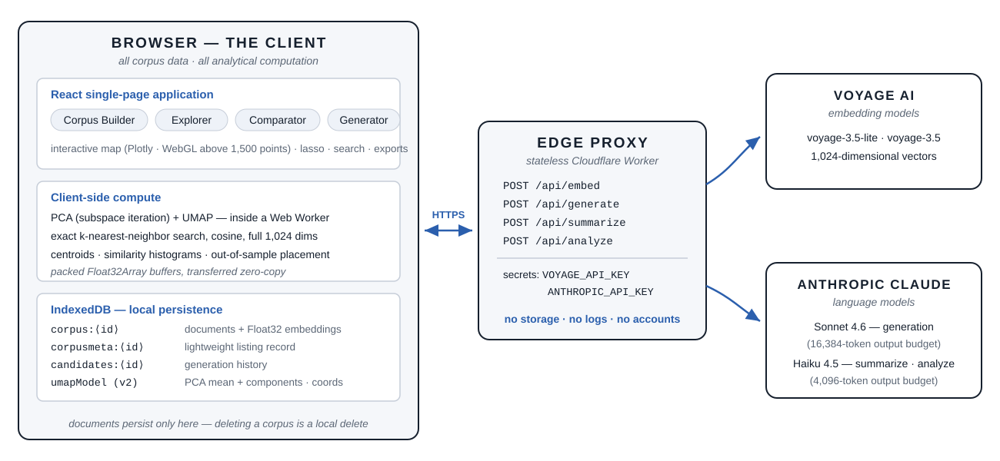
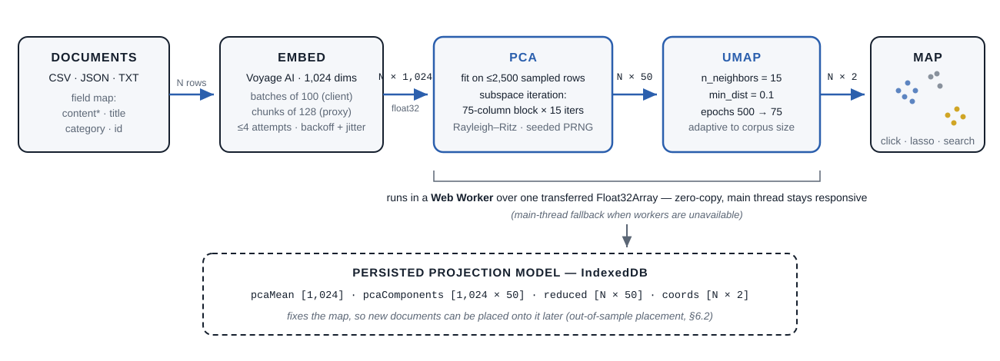
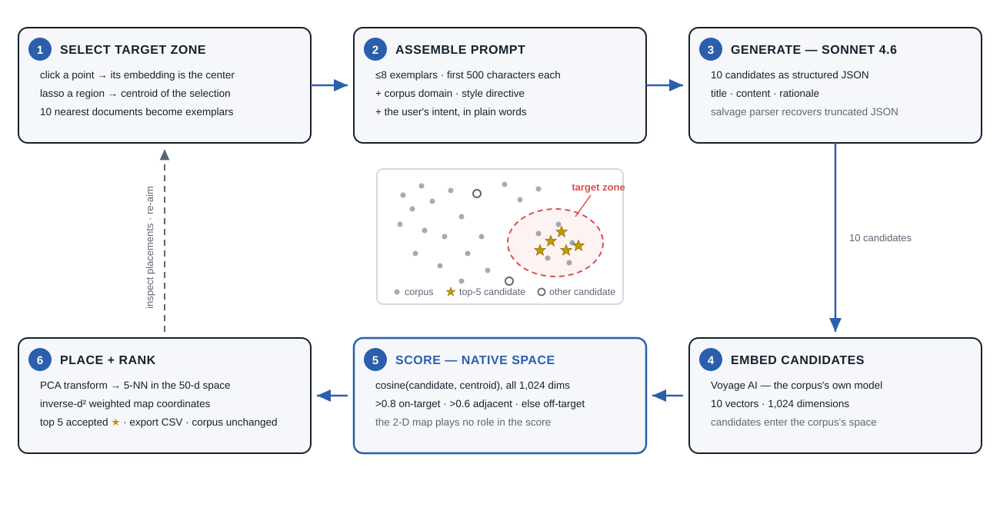

# Document Intelligence: A Browser-Native System for Semantic Corpus Mapping and Map-Targeted Document Generation

**J. E. Thomas**
jethomasphd@gmail.com

*Preprint — August 2026*

Live system: [document-intelligence.pages.dev](https://document-intelligence.pages.dev) · Source: [github.com/jethomasphd/Document_Intelligence](https://github.com/jethomasphd/Document_Intelligence)

---

> **Abstract** — Organizations hold more documents than any person can read. The structure that connects those documents — shared themes, outliers, gaps — stays invisible, because reading does not scale. Document Intelligence is an open-source, browser-native system that makes this structure visible and then makes it actionable. The system embeds each document as a 1,024-dimensional vector, reduces the vectors with a two-stage projection (sampled-covariance PCA solved by subspace iteration, then UMAP), and renders an interactive two-dimensional map in which proximity approximates similarity of meaning. All corpus data and all numerical computation stay on the client: the projection runs in a Web Worker over packed typed arrays, and the corpus persists in the browser's IndexedDB. A stateless edge function holds the API keys and relays embedding and language-model calls, so the platform operates with no server database. The system then closes the loop between analysis and synthesis. A user selects a region of the map, and a large language model writes candidate documents intended to land in that region. The system embeds every candidate with the corpus model, scores it against the target centroid in the native embedding space, and places it on the map. Generation becomes a claim that the system can test. This paper describes the architecture, the projection pipeline, the out-of-sample placement method, the generate-and-verify loop, and the trade-offs of running corpus analytics entirely in a browser.
>
> **Keywords** — text embeddings, dimensionality reduction, UMAP, visual analytics, controllable text generation, client-side computation, large language models

---

## 1 Introduction

A corpus is easy to store and hard to see.

A marketing team holds two thousand email subject lines. A laboratory holds a decade of abstracts. A firm holds every contract it has ever signed. Each document was written for a reason, but a person can read only one document at a time. At the scale of a collection, the important questions are relational: Which documents say the same thing in different words? Where do two groups of documents overlap? What is missing? Keyword search cannot answer these questions, because the questions are about meaning, and meaning does not reduce to shared words.

Neural text embeddings changed the raw material of this problem [1, 2]. An embedding model maps a text to a point in a high-dimensional vector space, and it places texts with similar meaning near each other. A corpus therefore has a geometry. A subject line about "fiscal Q3 performance" sits near one about "quarterly revenue results," although the two share almost no vocabulary. Once meaning has a geometry, the questions above become spatial questions, and spatial questions have visual answers.

Document Intelligence is a system built on this premise, with two design commitments that distinguish it from prior corpus-visualization tools.

**First commitment: the browser is the computer.** The system has no server database and no server-side analytics. Document text, embeddings, and the fitted projection model live in the browser's IndexedDB. Principal component analysis, UMAP, and all nearest-neighbor search execute in client-side JavaScript, with the heavy projection work in a Web Worker over packed `Float32Array` buffers. The only server component is a stateless Cloudflare Worker of a few hundred lines. It holds two API keys and relays four kinds of request. This design gives privacy by construction, removes all infrastructure between the user and the analysis, and makes the deployment a static site.

**Second commitment: the map is a surface for writing, not only for reading.** Existing embedding-projection tools let a user look at a corpus [5, 12]. Document Intelligence also lets the user point at a region of the map and ask for new documents that belong there. The system assembles the region's nearest documents as exemplars, prompts a large language model, and then *verifies* the output: it embeds each candidate with the same model that embedded the corpus, scores the candidate against the target centroid by cosine similarity in the full 1,024-dimensional space, and places the candidate on the 2-D map through a stored out-of-sample projection. The language model's claim — "this text belongs in that region" — is tested with the same instrument that drew the region.

The contributions of this paper are:

1. **A zero-backend architecture** for semantic corpus analysis, in which the corpus never persists outside the user's browser and secrets never reach the client (Section 3).
2. **A browser-tuned projection pipeline** — sampled-covariance PCA solved by subspace iteration with a Rayleigh–Ritz step, followed by UMAP with an adaptive epoch schedule — that maps corpora of roughly 10 to beyond 10,000 documents on commodity hardware without freezing the interface (Section 4).
3. **A persistent, reusable projection model** that places new documents onto a fixed map by PCA transformation and inverse-distance-weighted nearest-neighbor interpolation (Section 6.2).
4. **A generate-and-verify loop** that turns text generation into a targeting problem with a measurable outcome (Section 6).

The system is deployed and open source under the MIT license.

## 2 Related Work

**Embedding projection and corpus cartography.** The Embedding Projector [5] established interactive PCA/t-SNE/UMAP views of embedding sets, and tools such as Nomic Atlas [12] scale corpus maps to millions of points with server-side infrastructure. Document Intelligence occupies a different point in the design space: modest corpus sizes, zero infrastructure, full data locality, and a generative layer that these read-only tools do not attempt.

**Dimensionality reduction.** t-SNE [4] and UMAP [3] are the standard methods for projecting embeddings to two dimensions. Both preserve local neighborhoods well and distort global distances, and both require care in reading [6]. The system uses UMAP for the visible layout and deliberately performs all similarity measurement in the native embedding space, so distortion in the picture cannot corrupt a score. The PCA front-end follows the randomized subspace-iteration recipe analyzed by Halko, Martinsson, and Tropp [7].

**Conditioned generation.** Prompting a language model with retrieved examples is the few-shot pattern [8], and conditioning generation on retrieved corpus content is retrieval-augmented generation [9]. The generator in this system is a spatial variant of that pattern: retrieval is a nearest-neighbor query around a user-chosen point in embedding space, and — unlike standard RAG — the output is embedded again and scored against the target, so the conditioning loop closes with a measurement.

## 3 System Architecture

The system separates into three planes (Figure 1).

**The client** is a React single-page application. It contains the corpus builder, the interactive map (Explorer), the population comparison view (Comparator), and the generator. All analytical computation — projection, nearest-neighbor search, centroids, similarity histograms — runs here. The corpus persists in IndexedDB [11] through three kinds of record: `corpus:<id>` holds the documents with their embeddings, `corpusmeta:<id>` is a lightweight listing record so the home screen never loads full documents, and `candidates:<id>` holds generation history. Embeddings are stored as native `Float32Array` objects, which IndexedDB's structured clone persists without any encoding step. Corpora saved by earlier versions used base64 strings; these are decoded on read and upgraded on the next save.

**The proxy** is a stateless Cloudflare Worker deployed at the network edge. It exposes four POST endpoints — `/api/embed`, `/api/generate`, `/api/summarize`, `/api/analyze` — and holds the two provider keys as deployment secrets. It stores nothing and logs nothing. The static frontend can therefore be served from a CDN with no secret material in the bundle.

**The model providers** are Voyage AI for embeddings (`voyage-3.5-lite` by default, `voyage-3.5` for higher fidelity; both 1,024 dimensions) and Anthropic for language-model calls (Claude Sonnet 4.6 for generation with a 16,384-token output budget; Claude Haiku 4.5 for summarization and comparative analysis with a 4,096-token budget).

*Figure 1. System architecture. The corpus, the projection model, and every analytical computation stay in the browser. A stateless edge proxy holds the API keys and relays embedding and language-model calls. No server stores user data.*

The privacy consequence is exact rather than rhetorical: document text leaves the browser only inside an embedding, generation, summarization, or analysis request, transits the stateless proxy to the model provider, and is never written to any server the platform operates. Deleting a corpus is a local IndexedDB deletion. There is no account, no telemetry, and no server copy to revoke.

## 4 From Text to Map: The Projection Pipeline

The pipeline turns a file of rows into an interactive map in four stages (Figure 2).

*Figure 2. The projection pipeline. N documents become an N × 1,024 embedding matrix, are reduced to 50 dimensions by sampled-covariance PCA, and are laid out in 2-D by UMAP. The fitted model — PCA mean and components, the reduced matrix, and the 2-D coordinates — is persisted so that new documents can be placed on the same map later.*

### 4.1 Ingestion

The corpus builder accepts CSV (parsed with a header row), JSON arrays, and plain text with one document per line. The user maps columns to a small schema: *content* (required — the text that is embedded), and optionally *title*, *category*, and *id*. Categories become color-coded populations on the map and are auto-detected from the mapped column. The interface recommends 10 to 10,000+ documents and warns that texts under roughly ten words embed weakly.

### 4.2 Embedding

The client embeds documents in batches of 100 per request, with up to four attempts per batch under exponential backoff (2 s, 4 s, 8 s) plus random jitter. The proxy further chunks each request into groups of 128 texts, the provider's batch granularity. Every document receives a 1,024-dimensional vector from the model the user selected at corpus creation; this choice is recorded on the corpus, because a map is valid only for vectors from one model. Embedding a 1,000-document corpus typically completes in 30–60 seconds.

### 4.3 Stage one: PCA by subspace iteration

Full-spectrum PCA in JavaScript is too slow at this scale — a library SVD of a 2,500 × 1,024 sample took roughly 45 seconds in development testing. The system instead computes only the components it needs, with three economies.

*Sampling.* The PCA is fitted on at most 2,500 rows, chosen at evenly spaced indices so the sample spans any ordering of the data. The fitted components are then applied to all N rows. For visualization purposes the sampled fit recovers the same principal directions as a full fit.

*Subspace iteration.* The fit accumulates the sample's 1,024 × 1,024 covariance in double precision, then runs block power iteration: a block of 75 columns (the 50 target components plus 25 oversample columns) is repeatedly multiplied by the covariance and re-orthonormalized by modified Gram–Schmidt, for 15 iterations. Oversampling protects accuracy when eigenvalues near the cut are weakly separated [7]. A Rayleigh–Ritz step — a Jacobi eigendecomposition of the 75 × 75 projected matrix — then extracts the exact top-50 directions within the converged subspace, correctly ordered. The random initialization uses a seeded linear congruential generator, so a given corpus always produces the same fit.

*Typed arrays end to end.* Embeddings are packed into one contiguous `Float32Array` (about 4 MB per 1,000 documents) and transferred — not copied — into a Web Worker, where the whole pipeline runs off the main thread; a main-thread fallback covers environments without workers. Plain JavaScript number arrays cost three to four times the memory and made large corpora crash the tab before this design. The covariance accumulation is chunked (512 rows per slice) and yields to the event loop between chunks, so progress reporting stays live.

The result of stage one is an N × 50 matrix (the target dimension is clamped for corpora smaller than 50 documents), plus the mean vector and the 1,024 × 50 component matrix.

### 4.4 Stage two: UMAP

UMAP [3] reduces the 50-dimensional points to 2-D with `n_neighbors` = 15 (clamped to N − 1 for tiny corpora), `min_dist` = 0.1, and an epoch budget that adapts to corpus size: 500 epochs below 50 documents, stepping down to 75 epochs at 10,000 documents and above. The layout optimization reports per-epoch progress; the k-nearest-neighbor graph construction that precedes it is surfaced to the user as its own phase, because it is the longest synchronous step for large corpora.

### 4.5 The persistent projection model

The pipeline's output is stored on the corpus as a versioned model: the PCA mean and components, the packed N × 50 reduced matrix, and the N × 2 coordinates. This record is what makes the map *reusable* — Section 6.2 places new documents with it — and it round-trips through IndexedDB as typed arrays at roughly a quarter of the size of the nested-array format the first version used, which remains readable through a legacy path.

The Explorer renders the coordinates with Plotly, switching from SVG to WebGL above 1,500 points and shrinking markers as density grows; the map stays interactive beyond 10,000 points.

## 5 Reading the Map: Inspection and Comparison

Two analytical views operate on the mapped corpus. Both measure in the native space, and both use exact search — at this scale (≤ 10⁴ documents), a linear cosine scan is instantaneous and avoids approximate-index complexity.

**Inspection.** Clicking a point opens the document with its 25 nearest neighbors by cosine similarity over the full 1,024-dimensional embeddings, optionally filtered by category. Interface badges translate scores into an interpretive rubric (≥ 0.8 very similar; 0.6–0.8 related; 0.4–0.6 loosely related). A summarize action sends the document, its metadata, and its top neighbors' titles to Claude Haiku, which returns an analysis adapted to document length. Neighborhoods export as CSV, per document or deduplicated across an entire category.

**Comparison.** The Comparator asks a directional question: how does population A sit relative to population B? For every document in A it finds the 25 nearest neighbors in B and records the similarity of each pair. The result is a distribution — rendered as a 20-bin histogram with its mean — rather than a single number, because two populations can share a mean while differing entirely in shape: a bimodal histogram reveals a subgroup of A that B echoes closely and a subgroup it does not. An optional narrative pass sends five samples from each population and the mean similarity to Claude Haiku, which returns a short account of where the populations converge and diverge. Pairs, statistics, and narrative export as CSV and Markdown.

A recurring workflow builds on comparison: tag best-performing documents as one category, compare them against the rest, and observe where the winners cluster. The regions where winners concentrate — and the adjacent regions where nothing exists — become the natural targets for the generator.

## 6 Writing Onto the Map: Targeted Generation

The generator inverts the reading direction. Instead of asking *what is here?*, the user points at a region and asks *what would belong here?* (Figure 3).

*Figure 3. The generate-and-verify loop. A target zone yields a centroid and exemplar documents; a language model writes ten candidates; each candidate is embedded with the corpus model, scored against the centroid in the native 1,024-dimensional space, and placed on the map by the stored projection model. Ranking marks the top five. The verification instrument is independent of the generator.*

### 6.1 Target selection and prompt assembly

A click selects a single document: its embedding becomes the zone center, and its ten nearest neighbors become the exemplars. A lasso selects a region: the centroid of the selected embeddings becomes the zone center, and the ten documents nearest that centroid become the exemplars. Up to eight exemplars — title, category, and the first 500 characters of content — are sent with the corpus domain, a user prompt, and one of six style directives. Claude Sonnet 4.6 returns ten candidates as structured JSON, each with a title, content, and a rationale for why it should fit the zone; a salvage parser recovers complete candidate objects if the model's JSON arrives truncated.

### 6.2 Verification

Verification is the load-bearing step, and it is deliberately split across two spaces.

*Scoring happens in the native space.* Each candidate is embedded with the same Voyage model as the corpus and scored by cosine similarity against the zone centroid over all 1,024 dimensions. The 2-D map plays no role in the score, so UMAP's distortions cannot flatter a candidate. Thresholds label each candidate on-target (> 0.8), adjacent (> 0.6), or off-target.

*Placement happens on the map.* Each candidate embedding is centered with the stored PCA mean, projected through the stored components into the 50-dimensional space, and matched against the corpus's reduced matrix in a single pass that keeps the five nearest rows by squared Euclidean distance. The candidate is drawn at the weighted average of those five documents' 2-D coordinates, with weights proportional to the inverse of the squared distance (plus a small ε for stability). The user sees the ten candidates land on the very map they aimed at — the top five ranked candidates as gold stars, the rest gray.

### 6.3 Output discipline

Candidates are ranked by similarity, and the top five are marked accepted. Nothing is written into the corpus: generated documents export as CSV (all ten, or the top five) and remain cleanly separated from source data. The corpus stays a record of what the organization actually wrote, and generated material carries its scores and placements with it.

The loop's value is falsifiability. When a candidate scores 0.87 against the centroid, that is not the generator grading its own work — it is an independent measurement by the same instrument that structured the corpus. When a candidate lands off-target, the user sees it, and the miss itself is informative: it locates the difference between what was asked for and what the region contains.

## 7 Design Decisions and Limitations

**Why client-side computation.** Three reasons. Privacy: the corpus cannot leak from infrastructure that does not exist. Cost: the platform's marginal cost is exactly the metered API calls; projection and search are free on the user's hardware. Simplicity: deployment is a static bundle plus one edge function, and there is no capacity to plan. The price is a ceiling — the browser tab bounds memory, so the practical corpus scale is on the order of 10⁴ documents, and every device recomputes what a server would compute once.

**Determinism.** The PCA is seeded and its sampling is deterministic, so refitting a corpus reproduces the same reduced space. UMAP's layout remains stochastic across runs; the persisted model pins one layout, and all downstream placement is deterministic given that model.

**The map is a view, not the metric.** UMAP preserves neighborhoods, not global distances [3, 6]. The system's discipline is that every number a user might act on — neighbor lists, comparison distributions, candidate scores — is computed in the native embedding space, and the map is the *index* into those numbers, never their source.

**Placement is interpolation.** Out-of-sample placement averages the coordinates of five nearest corpus documents, so a candidate can never be drawn outside the territory the corpus already occupies. A candidate that is genuinely novel — semantically outside the corpus — still lands inside the picture, though its low similarity score reveals the distance. The score, not the placement, is the authority; the papers travel together for exactly this reason.

**The proxy is open by design and cost-exposed by consequence.** The edge function accepts cross-origin requests without authentication, which keeps the demo frictionless but lets any caller spend the deployment's API budget. A production deployment should add origin checks and rate limits; the architecture accommodates both without touching the client.

**Model coupling.** A corpus is bound to the embedding model that built it. Scores and placements are meaningful only within one model's space, so the corpus records its model and reuses it for search queries and candidate verification alike. Changing models means re-embedding.

**Scale of the comparison.** The Comparator's cross-population search is O(|A| · |B|) exact cosine work. At the system's intended scale this completes in seconds; at 10⁵ documents it, and the projection pipeline, would need approximate nearest-neighbor indexes and incremental fitting — natural future work, along with in-browser embedding models (via WebGPU) that would remove the last network dependency, density-based gap detection to propose target zones automatically, and an accept-into-corpus workflow for generated documents.

## 8 Conclusion

Document Intelligence treats a document collection as a place: a territory with neighborhoods, borders, and empty lots. The system draws the territory from neural embeddings with a projection pipeline tuned to run entirely in a browser, keeps every document on the user's machine, and measures every claim in the native embedding space. Its central move is to make the map writable — to let a user point at a region, ask a language model for documents that belong there, and then check, with the corpus's own instrument, whether the new documents arrived. Analysis tells you where meaning lives. Generation with verification lets you build there.

## Acknowledgments

The system builds on Voyage AI embedding models and Anthropic Claude models for its metered services, and on the open-source `umap-js`, React, and Plotly projects.

## References

[1] N. Reimers and I. Gurevych. Sentence-BERT: Sentence embeddings using Siamese BERT-networks. *Proceedings of EMNLP-IJCNLP*, 2019. arXiv:1908.10084.

[2] Voyage AI. voyage-3.5 and voyage-3.5-lite model documentation, 2025. https://docs.voyageai.com.

[3] L. McInnes, J. Healy, and J. Melville. UMAP: Uniform manifold approximation and projection for dimension reduction. arXiv:1802.03426, 2018.

[4] L. van der Maaten and G. Hinton. Visualizing data using t-SNE. *Journal of Machine Learning Research*, 9:2579–2605, 2008.

[5] D. Smilkov, N. Thorat, C. Nicholson, E. Reif, F. B. Viégas, and M. Wattenberg. Embedding Projector: Interactive visualization and interpretation of embeddings. arXiv:1611.05469, 2016.

[6] M. Wattenberg, F. Viégas, and I. Johnson. How to use t-SNE effectively. *Distill*, 2016. doi:10.23915/distill.00002.

[7] N. Halko, P.-G. Martinsson, and J. A. Tropp. Finding structure with randomness: Probabilistic algorithms for constructing approximate matrix decompositions. *SIAM Review*, 53(2):217–288, 2011.

[8] T. Brown et al. Language models are few-shot learners. *Advances in Neural Information Processing Systems*, 33, 2020. arXiv:2005.14165.

[9] P. Lewis et al. Retrieval-augmented generation for knowledge-intensive NLP tasks. *Advances in Neural Information Processing Systems*, 33, 2020. arXiv:2005.11401.

[10] Anthropic. Claude model documentation (Claude Sonnet 4.6, Claude Haiku 4.5), 2025. https://docs.anthropic.com.

[11] W3C. Indexed Database API 3.0. W3C Working Draft. https://www.w3.org/TR/IndexedDB-3/.

[12] Nomic AI. Atlas: Interactive maps of large datasets. https://atlas.nomic.ai.

---

*The implementation described in this paper is available under the MIT license at github.com/jethomasphd/Document_Intelligence. A hosted instance runs at document-intelligence.pages.dev.*
